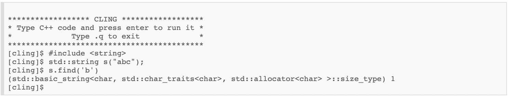

Cling interprets C++
=======================================

**Cling** is an interactive C++ interpreter built on top of `Clang <https://clang.llvm.org/>`_ and `LLVM <https://llvm.org/>`_.
It uses LLVM's *Just-In-Time* (`JIT <https://en.wikipedia.org/wiki/Just-in-time_compilation>`_) compiler to provide a fast and optimized compilation pipeline. Cling uses the `read-eval-print-loop <https://en.wikipedia.org/wiki/Read%E2%80%93eval%E2%80%93print_loop>`_ (**REPL**) approach, making rapid application development in C++ possible, avoiding the classic edit-compile-run-debug cycle approach. 
You can download Cling from `GitHub <https://github.com/root-project/cling>`_.

You can download Cling from: XXXXXXXXX TO BE COMPLETED

   

Table of Contents
--------

 .. toctree::
    :numbered:
   
    chapters/background
    chapters/interactivity
    chapters/implementation
    chapters/REPL
    chapters/XEUS
    chapters/cudaC++
    chapters/grammar
    chapters/references

.. note::

  This project is under active development.
  Cling has its documentation hosted on Read the Docs.
