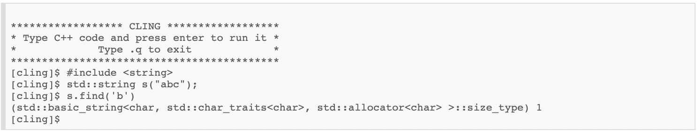

Cling interprets C++
====================

**Cling** is an interactive C++ interpreter built on top of `Clang
<https://clang.llvm.org/>`_ and `LLVM <https://llvm.org/>`_.  It uses LLVM's
*Just-In-Time* (`JIT <https://en.wikipedia.org/wiki/Just-in-time_compilation>`_)
compiler to provide a fast and optimized compilation pipeline. Cling uses the
`read-eval-print-loop
<https://en.wikipedia.org/wiki/Read%E2%80%93eval%E2%80%93print_loop>`_
(**REPL**) approach, making rapid application development in C++ possible,
avoiding the classic edit-compile-run-debug cycle approach.

Cling's last release, download instructions, dependencies, and any other useful
information for developers can be found on `Cling's GitHub webpage
<https://github.com/vgvassilev/cling>`_.

Find out more about **Interpreting C++** on the `Compiler Research Group
<https://compiler-research.org/>`_'s webpage.
   

Table of Contents
-----------------

 .. toctree::
    :numbered:
   
    chapters/background
    chapters/interactivity
    chapters/why_interpreting
    chapters/implementation
    chapters/REPL
    chapters/grammar
    chapters/applications
    chapters/conclusion
    chapters/references
   

.. note::

  This project is under active development.
  Cling has its documentation hosted on Read the Docs.

